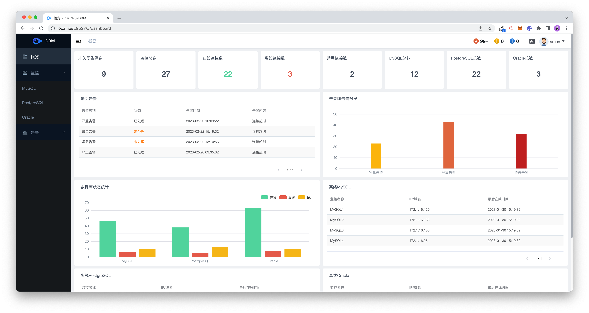

# ArgusDBM  

> Argus 开源数据库一体化监控平台，致力于监控所有数据库。

官网: [argus.zmops.cn](https://argus.zmops.cn/)

- 源于 [HertzBeat](https://github.com/dromara/hertzbeat) ，专注于数据库方向，优美的可视化界面，所见即所得。
- 开箱即用，无需部署Agent，配置IP端口账户等后即可监控，大大减少企业数据库监控流程。
- 操作简单，快捷好用，深度结合我们在监控领域的最佳实践。
- 无缝衔接Zabbix，自身可做为Agent对Zabbix的数据库监控短板增强。

---
  
---

## 🐕 快速开始

### 本地代码启动   

> 此为前后的分离架构，本地代码启动调试需分别启动后端服务和前端   

#### 后端本地代码启动   

1. 需安装 `maven3+`, `java11` 环境, `IDEA` 需安装 `lombok` 插件   
2. 主目录下执行 `mvn clean install`  
3. 启动 `springboot manager` 服务 `manager/src/main/java/com/zmops/open/manager/Manager.java`  
4. 后端服务 `swagger` 接口地址  http://localhost:1159/swagger-ui/index.html   
5. 默认账户密码  `argus/argus`

#### 前端本地代码启动   

1. 需安装 `nodejs npm` 环境
2. 在 `web-app` 目录下执行 `npm install`
3. 启动前端服务 `npm run dev`, 浏览器访问 http://localhost:9527 即可
4. 默认账户密码 `argus/argus` 
